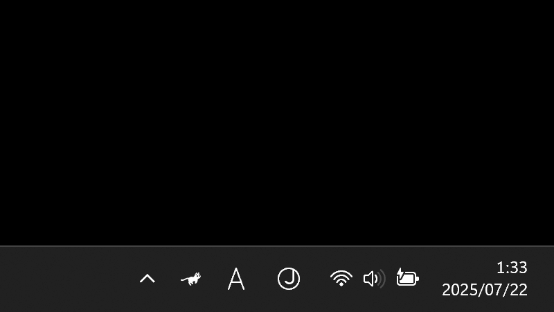

# RunCat 365

**A cute running cat animation on your Windows Taskbar.**

> [!CAUTION]
>
> - This project is for Windows, so we do not accept inquiries about macOS version.
> - We do not accept issues or pull requests in languages other than English.

`C#` `.NET 9.0` `Visual Studio` `RunCat`

# Demo

# Give it a try
